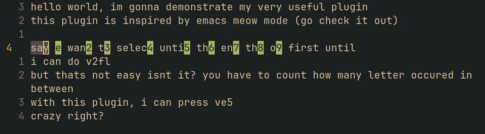
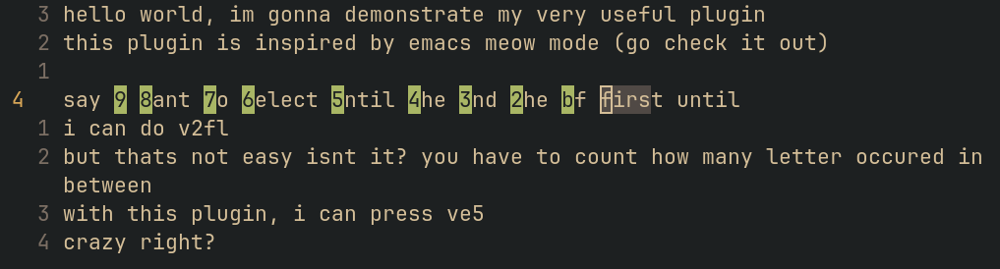

# Easy VSel
Easy Visual Selection

## features
TODO: video
### show overlay for count motion
've'

'vb'

### pressing count after command will repeat the command
ve3 will behave the same as ve3e. saves 1 keystroke
info: v3e behave the same as it was

## limitation
the last command only get removed after changing mode, therefore after pressing 'vel', all of the count (1..9) will still repeat 'e' motion

## inspiration
[Meow-mode](https://github.com/meow-edit/meow) (best selection-first editing): this plugin is basically a copy of its repeat selection feature

